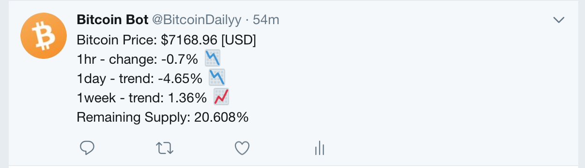

# bitcoin-price-twitter-bot
Bitcoin Price Twitter Bot
---

* Tweets every day at 8:00am UTC

<div align="center">

</div>

* To send a tweet trigger the heroku server 
```bash
git push; git push heroku master; heroku run node bot; # changes
heroku run node bot # no code changes
```

* Or configure the heroku scheduler addon to tweet every certain amount of time
```bash
heroku addons:create scheduler:standard
```